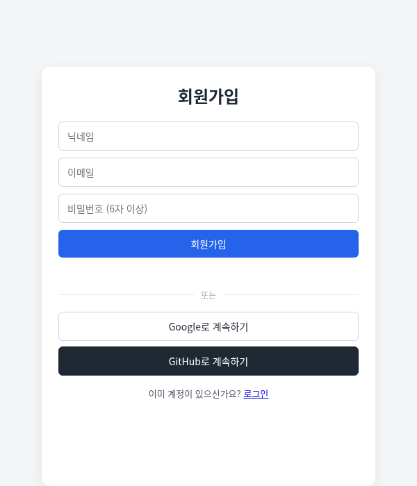
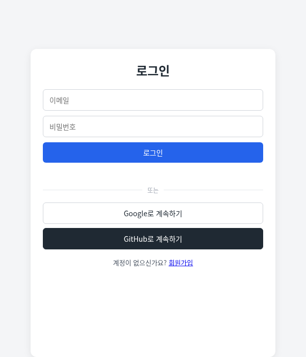
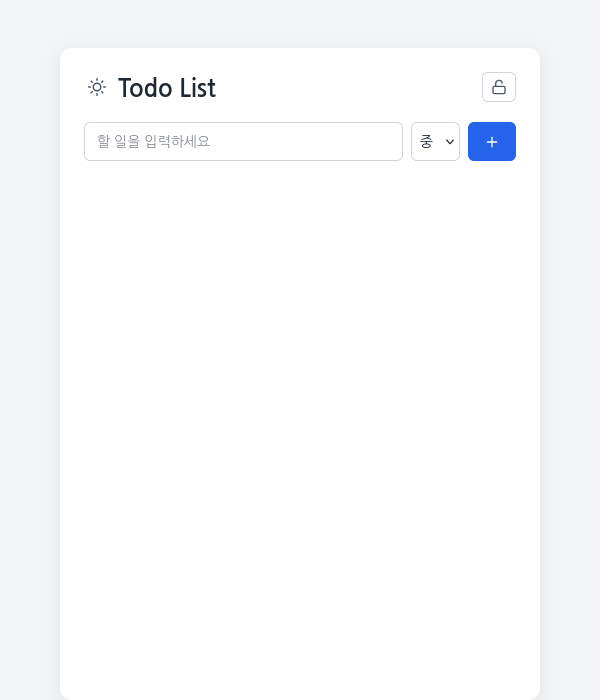
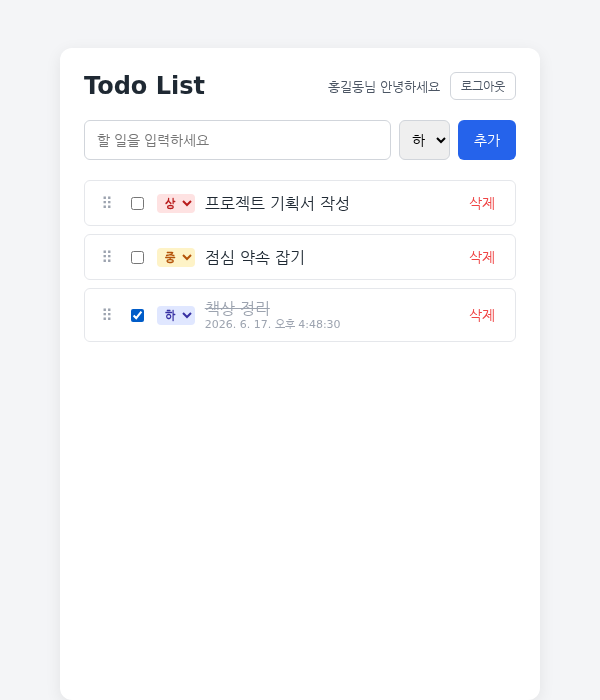

# Todo List

Supabase 기반 멀티유저 Todo List 앱. 회원가입 후 로그인하면 나만의 할 일
목록을 관리할 수 있고, 다른 사용자의 할 일은 보이지 않습니다.

**배포 사이트**: https://smjjang-dev.github.io/todoapp/

**Android 설치 파일**: [todoApp.apk](todoApp.apk) — 위 배포 사이트를 그대로 띄우는
TWA 방식 APK. Play 스토어 서명이 아니라 사이드로드(출처를 알 수 없는 앱 설치 허용)로만
설치 가능하다.

## 주요 기능

- 이메일/비밀번호로 회원가입·로그인 (닉네임 표시)
- Google/GitHub 계정으로 소셜 로그인(가입 동시 처리)
- 할 일 추가 시 중요도(상/중/하) 지정, 등록 후에도 언제든 변경 가능
- 완료 체크 시 완료 시각 자동 기록
- 드래그 핸들(⠿)로 순서 변경
- 사용자별 데이터 격리 — 내 할 일은 나만 볼 수 있음 (Supabase RLS)
- 라이트/다크 모드 토글("Todo List" 제목 옆 해/달 아이콘) — 선택한 테마는
  기기에 저장되어 다음 방문에도 유지됨
- 로그인·로그아웃·할 일 추가 버튼은 아이콘(자물쇠/＋)으로 표시

## 화면으로 보는 사용법

### 1. 회원가입

닉네임, 이메일, 비밀번호(6자 이상)를 입력하고 가입하거나, Google/GitHub
버튼으로 바로 가입할 수 있습니다.

### 2. 로그인

가입한 이메일/비밀번호로 로그인하거나, Google/GitHub 계정으로 바로
로그인합니다.

### 3. 할 일 목록 (빈 상태)

로그인하면 닉네임이 표시되고, 아직 할 일이 없으면 안내 문구가 보입니다.

### 4. 할 일 등록 및 관리

할 일을 추가할 때 중요도를 선택할 수 있고, 각 항목의 중요도 배지를 눌러
나중에 바꿀 수도 있습니다. 완료 체크하면 완료 시각이 함께 표시됩니다.

## 사용 순서 요약

1. 회원가입 → 2. 로그인 → 3. 할 일 입력 후 중요도 선택해 추가 → 4. 완료되면
체크박스 클릭 → 5. 필요하면 중요도 배지를 눌러 재분류 → 6. 드래그 핸들로
순서 변경 → 7. 로그아웃

## 더 알아보기

- 개발/기술 문서: [CLAUDE.md](CLAUDE.md)
- 배포 절차: [GitHubPages.md](GitHubPages.md)
- 보안 검토(CVE/CWE): [CVE.md](CVE.md)
